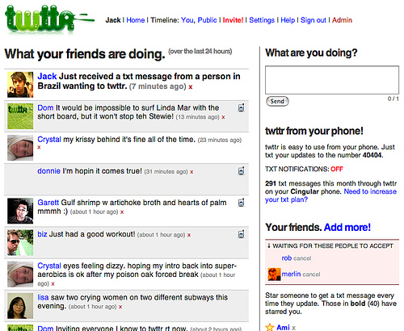
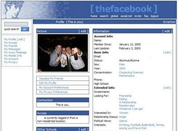
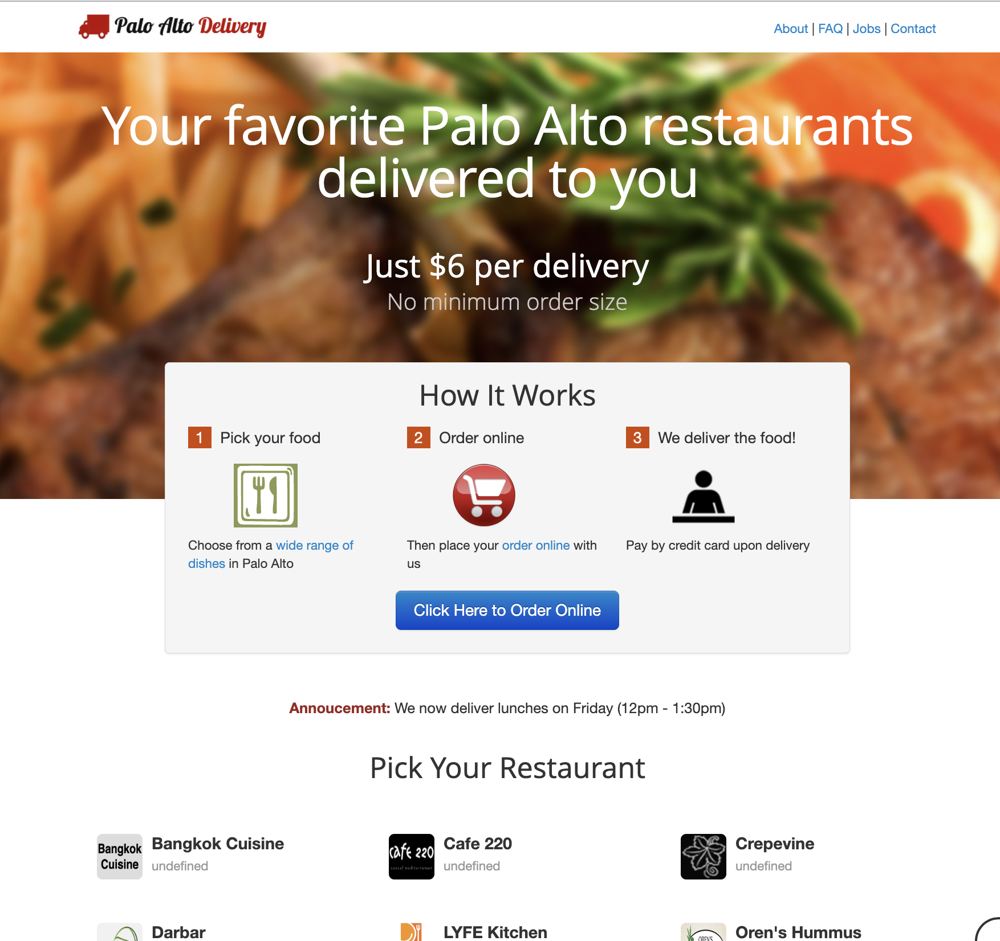
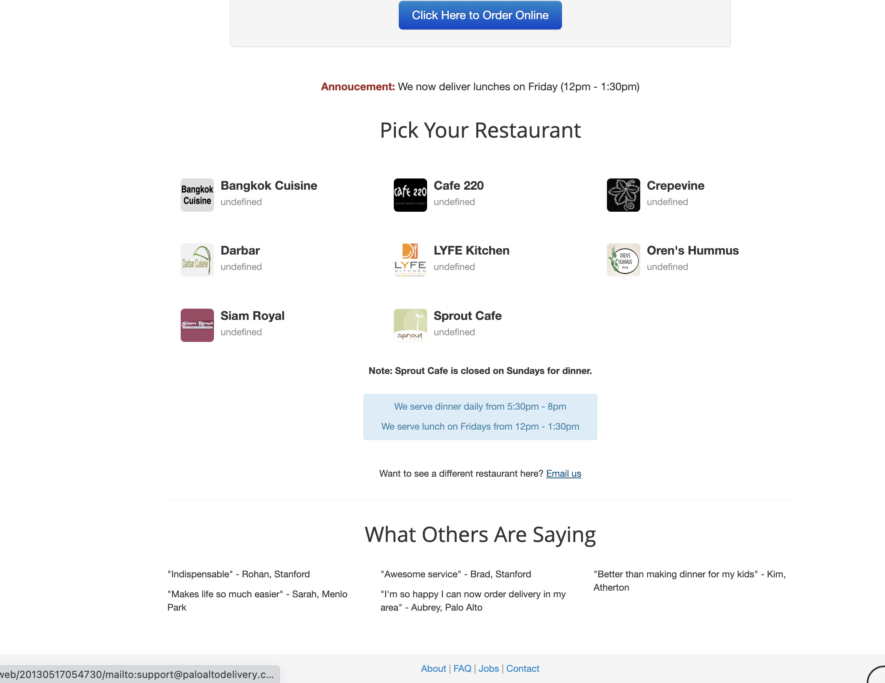
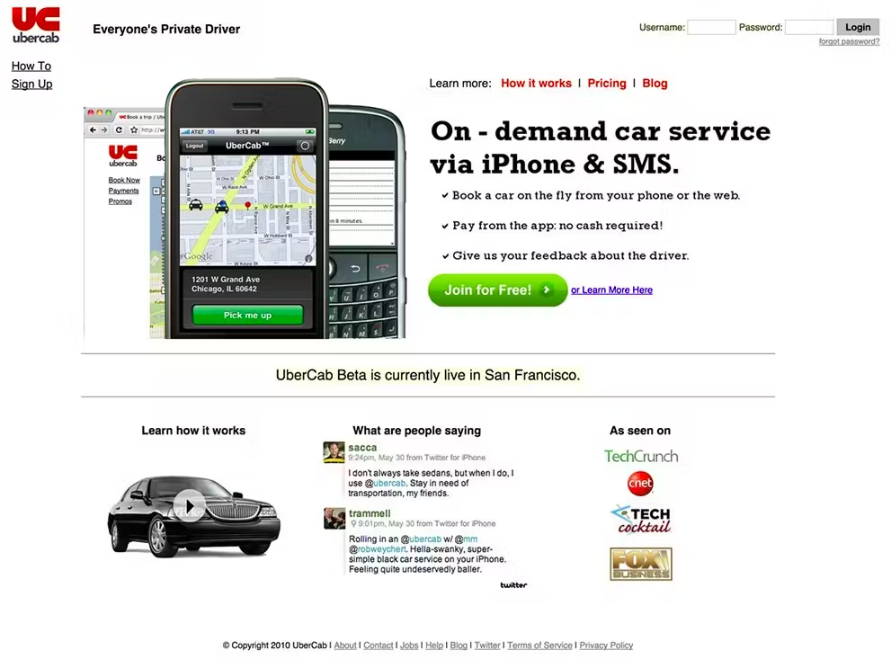
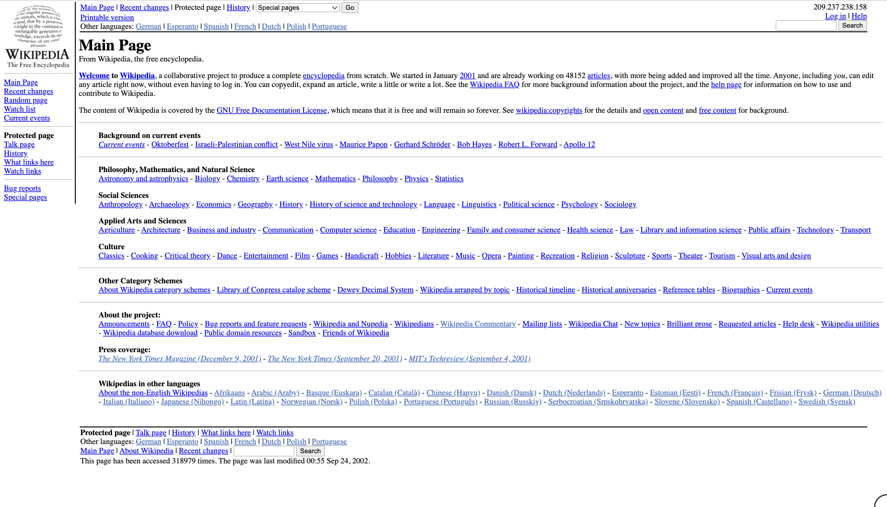

> Everything Should Be Made as Simple as Possible, But Not Simpler

<!-- Einstein maybe -->
---

- The first step towards implementing a full product is eliminating the biggest unknowns with small, experimental, proofs of concept.

---

# The big questions
- Where is the required information coming from?
    - Are our users supplying it?
    - Is it available from an API?
    - Can we download a CSV from a government website?
    - Can we scrape a website for it?
 
---
# The big questions
- Is our domain model correct?
- Did we identify all of the information we need to store to solve the problem?
- Is our database architecture correct — i.e. are our tables and columns sufficient to store the information?

---
# The big questions
- Are we solving the right problem, or is an adjacent one more pressing?

---
# The big questions
- Who is your user?
- Can we develop some key personas?
---
- We usually throw away the code from 3 or 4 of these small experiments before we build out anything resembling the first real product.
---
# Develop and Test a Hypothesis
- What assumptions are we making about our users?
- How can we test these assumptions quickly and effectively?
- Before fully committing to a development path, it's crucial to formulate clear hypotheses about your project's key aspects and validate them through targeted experiments.
- This approach ensures that your solutions are grounded in reality and meet the actual needs of your users.

<!-- Suppose you're building a web application aimed at helping people find local volunteering opportunities. A hypothesis could be, "Users prefer to search for volunteering opportunities by skill set rather than location." -->
---

- So, keep it simple!
- Don't complicate the codebase by planning 6 months worth of features ahead.
- Your "vision" could be totally wrong! (spoiler: it probably is 😜)

---

- What's the smallest thing you can build right now that will allow you to test one hypothesis?

---

- Chat with us during lab to help select an idea (hopefully from among a handful) and scope it down to a good initial feature set.

---

- Let's use the [wayback machine](https://archive.org/web/) check out what the initial launches of some famous startups looked like.

---

<!-- # Airbnb -->

<!-- 
- Brian/Joe couldn't afford rent
- took a few pictures of their loft, created a web page and had 3 paying guests for a convention.
- pivotted to roommate matching
- only air beds!
- only conventions and big events at first
 -->

---

<!-- # Twitter -->

<!-- 

- original Twitter prototype was designed for internal users at Odeo as a way to send messages to other employees and view them on a group level.

Jack (an undergrad student) introduced the idea of an individual using an SMS service to communicate with a small group during a company brainstorming session.

 -->

---

<!-- 

- built by Paul Bucheit at Google because he hated microsoft products (preferred linux) and needed a way to use email on a linux machine
- the v1 only worked for Paul's email
- he started sharing it with co-workers and added features as needed in order to convert people from outlook to gmail
- He usually showed up later in the day and he realized how important email was when one day gmail wasn't working and everyone in the office was staring at him when he showed up

- it launched as "invite only" because they had limited server storage space. it made people want to try it even more.

 -->

---

<!-- # Facebook -->

<!-- 
- originally created the application as a universal directory (or facebook, as it is known at Harvard) for students at Harvard University

- previously created facemash and a study guide app he used to pass his Art History class
- re-used the code from these apps to create facebook

 -->

---

---

<!-- # Instagram -->

<!-- 
- Instagram’s predecessor, Burbn, was initially designed to allow users to check-in and share their experiences at various locations with friends.

- The initial app, in Kevin Systrom's words, “felt cluttered and overrun with features”. Adoption was poor, and users found the app confusing.

- one feature, however, that users loved. Easy photo-sharing. 

- So Systrom made a tough choice. He took the Burbn MVP and completely overhauled it:
We went out on a limb, and basically cut everything in the Burbn app except for its photo, comment, and like capabilities. What remained was Instagram.

 -->

 ---

<!-- # Amazon -->

<!-- 
- just books

- takes expenses and turns them into profitable businesses (aws, delivery, warehousing etc.)

- 
 -->

---

<!-- # Twitch -->

<!-- 
- originally called a justin.tv a livestream of Justin's life
- just 1 channel
- Justin wanted to be famous (influencer)
 -->

---

<!-- # Reddit -->

<!-- 

- created a bunch of fake users and commented on each other's posts
- just users, posts, votes

 -->

---

<!-- 

- were doing user interviews for a small business app they were working on
- store owner told them how hard it was to offer delivery
- launched a website with a personal phone number and would hand deliver food
- only worked with a few restaurants at first

-->

---

---
<!-- 

- Tope Awotona was frustrated with the difficulty of scheduling sales calls

 -->

---

<!-- 

Originally, the application only allowed users to hail a black luxury car in SF and the price was approximately 1.5 times that of a taxi.

 -->

---
<!-- 
- Drew Houston conceived the Dropbox concept after repeatedly forgetting his USB flash drive while he was a student at MIT
 -->

---

---
<!-- 

- Other search engines ranked results by counting how many times the search terms appeared on the page, google analyzed the relationships among websites.
- "PageRank" determined a website's relevance by the number of pages, and the importance of those pages that linked back to the original site

- at one point the internet got too big for their indexing algorithm, so the search results weren't updated for months
- they had to innovate to create a solution
 -->

---

- Try to focus on solving 1 specific problem for a specific user
- Even huge tech companies started with very simple products
<!-- X, Tencent, Meta, Google, etc. with 1000s of engineers struggle to build "all in one" "super" apps -->
- Please maintain focus and solve a specific problem for a real life person.

---

# Summary
1. Simple Idea 💡
2. Build 👷
3. Launch 🚀
4. Do people want this? 👂
5. Repeat / Iterate 🔁

---
# Resources

- [How Startups Beat Incumbents](https://longform.asmartbear.com/startup-beats-incumbent)
- [Elon's 5-Step Engineering Design Process](https://gist.github.com/heratyian/5b11e955c557382c9c14909af827f3b7)
